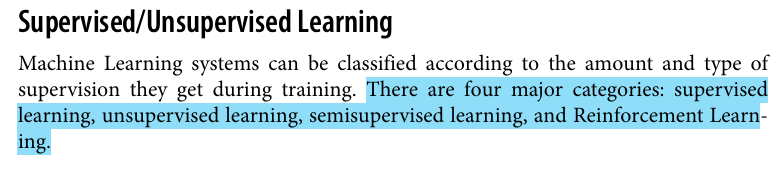

    • In Supervised learning, the training data you feed to the algorithm includes the desired solutions, called labels 
        ○ Classifications : A typical supervised learning task is classification. (spam Filter -  spam and ham)
        ○ Regression : Another Typical task such as the price of a car, given a set of features (mileage, age, brand, etc.) called predictors.

*Here are some of the most important supervised learning algorithms*

     • k-Nearest Neighbors  - vid1
     • Linear Regression
     • Logistic Regression
     • Support Vector Machines (SVMs)
     • Decision Trees and Random Forests
     • Neural networks

        • Unsupervised machine learning is a type of machine learning where the algorithm learns patterns from data that is not labeled. This means the data doesn’t have predefined categories or outcomes. Instead, the algorithm tries to find hidden patterns or groupings within the data on its own.
        
        • For example, if you have a bunch of photos of animals but no labels saying which animal is in each photo, an unsupervised learning algorithm can group similar photos together, like all the photos of cats in one group and all the photos of dogs in another.
     
     
     The formula for RAE: 
     
     `RAE = Σ|actual - predicted| / Σ|actual - mean|`

     
        • It's important to note the distinction between Relative Absolute Error (RAE) and Residual Sum of Squares (RSS):
     
        • Relative Absolute Error (RAE): Measures the average absolute difference between actual and predicted values relative to the average absolute difference between actual values and their mean.
     
        • Residual Sum of Squares (RSS): Calculates the sum of the squared differences between actual and predicted values.
     
     The formula for RSS: 
     
     RSS = Σ(actual - predicted)^2
     
---

Machine learning (ML) is a subdomain of artificial intelligence (AI) that focuses on developing systems that learn—or improve performance—based on the data they ingest. Artificial intelligence is a broad word that refers to systems or machines that resemble human intelligence. Machine learning and AI are frequently discussed together, and the terms are occasionally used interchangeably, although they do not signify the same thing. A crucial distinction is that, while all machine learning is AI, not all AI is machine learning.

- What is Machine Learning?
Machine Learning is the field of study that gives computers the capability to learn without being explicitly programmed. ML is one of the most exciting technologies that one would have ever come across. As it is evident from the name, it gives the computer that makes it more similar to humans: The ability to learn. Machine learning is actively being used today, perhaps in many more places than one would expect

From https://www.geeksforgeeks.org/machine-learning/
- Two most common use cases of Supervised learning are: 
    - • Classification: Inputs are divided into two or more classes, and the learner must produce a model that assigns unseen inputs to one or more (multi-label classification) of these classes and predicts whether or not something belongs to a particular class. This is typically tackled in a supervised way.  Classification models can be categorized in two groups: Binary classification and Multiclass Classification. Spam filtering is an example of binary classification, where the inputs are email (or other) messages and the classes are “spam” and “not spam”.
    - • Regression: It is also a supervised learning problem, that predicts a numeric value and outputs are continuous rather than discrete. For example, predicting stock prices using historical data.

From <https://www.geeksforgeeks.org/getting-started-machine-learning/> 

Python’s Role in Machine Learning
Python has a crucial role in machine learning because Python provides libraries like NumPy, Pandas, Scikit-learn, TensorFlow, and Keras. These libraries offer tools and functions essential for data manipulation, analysis, and building machine learning models. It is well-known for its readability and offers platform independence. These all things make it the perfect language of choice for Machine Learning.

From <https://www.geeksforgeeks.org/machine-learning-with-python/?ref=ml_lbp> 

     
     
     
