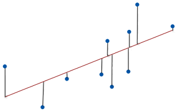

## Mean Absolute Error (MAE)

- In evaluating the quality of a regression model, several metrics are used, with one of the simplest being the **Mean Absolute Error (MAE)**. Let's first break down the concept of "error."

- The **prediction error** for each instance is calculated as:

  ```error = actual value − predicted value```

- For example, if a house's actual price is $150,000 and your model predicts $100,000, the error would be $50,000.

- **MAE** takes the absolute value of each prediction error, converting all errors to positive values. Then, it averages these absolute errors, providing a measure of how far off, on average, the model's predictions are. In simple terms:

  **"On average, our predictions are off by about X."**

#### Formula for Mean Absolute Error (MAE):

```math
\text{MAE} = \frac{1}{n} \sum_{i=1}^{n} | y_i - \hat{y_i} |
```

Where:
- \( y_i \) is the actual value.
- \( \hat{y_i} \) is the predicted value.
- \( n \) is the number of predictions.

#### Example Code for Calculating MAE:

```python
from sklearn.metrics import mean_absolute_error

predicted_home_prices = model.predict(X)
mae = mean_absolute_error(y_true, predicted_home_prices) ## Observe this line
print("Mean Absolute Error:", mae)
```

```python
Output : 434.71594577146544
```

#### Example Code 2 for Calculating MAE:
```python

from sklearn.metrics import mean_absolute_error
from sklearn.tree import DecisionTreeRegressor

def get_mae(max_leaf_nodes, train_X, val_X, train_y, val_y):
    model = DecisionTreeRegressor(max_leaf_nodes=max_leaf_nodes, random_state=0)
    model.fit(train_X, train_y)
    preds_val = model.predict(val_X)
    mae = mean_absolute_error(val_y, preds_val)
    return(mae)


```

---

## Root Mean Square Error (RMSE)

- Another common metric for regression model performance is the **Root Mean Square Error (RMSE)**.

#### Formula for Root Mean Square Error (RMSE):

```math
\text{RMSE} = \sqrt{ \frac{1}{n} \sum_{i=1}^{n} ( y_i - \hat{y_i} )^2 }
```

Where:
- \( y_i \) is the actual value.
- \( \hat{y_i} \) is the predicted value.
- \( n \) is the number of predictions.

### What is Root Mean Square Error?

RMSE measures the **average magnitude of error** between the predicted values and the actual values in a model. It represents the **standard deviation of the residuals**, which are the differences between the predicted and actual values. In other words, RMSE tells us how far the observed data points are from the regression line.

- RMSE can take any value from zero to positive infinity, and it uses the same units as the dependent variable (e.g., dollars, meters).

- A **RMSE of 0** would indicate a perfect prediction match, though this is rarely achievable in practice. Lower RMSE values indicate a model with higher predictive accuracy, while higher RMSE values suggest the model is less precise.

### Visualization of Residuals and RMSE:



---

### Key Insights:
- **Lower RMSE** values indicate better model performance, as the predictions are closer to the actual values.
- RMSE is particularly useful for comparing the performance of different models or assessing how well a model generalizes to new data.

---

### Sources:
- Aurélien Géron, *Hands-On Machine Learning with Scikit-Learn, Keras, and TensorFlow: Concepts, Tools, and Techniques to Build Intelligent Systems* (Book)
- [Root Mean Square Error (RMSE) Overview](https://statisticsbyjim.com/regression/root-mean-square-error-rmse/)

---


## Get back repo? --> : [https://github.com/3XCeptional/Ml-and-Data-Science-Notes-Notebooks/](https://github.com/3XCeptional/Ml-and-Data-Science-Notes-Notebooks/)

