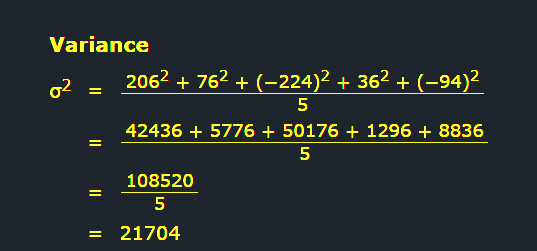

## Root Mean Square Error (RMSE)

- A typical performance measure for regression problems is the Root Mean Square Error (RMSE).

## What is the Root Mean Square Error?

The root mean square error (RMSE) **measures the average difference between a statistical model’s predicted values and the actual values**. Mathematically, it is the standard deviation of the residuals. Residuals represent the distance between the regression line and the data points.

RMSE quantifies how dispersed these residuals are, revealing how tightly the observed data clusters around the predicted values.

Image depicting the relationship between the residuals and the root mean square error (RMSE).

- 

- RMSE values can range from zero to positive infinity and use the same units as the dependent (outcome) variable.

- A value of 0 means that the predicted values perfectly match the actual values, but you’ll never see that in practice. Low RMSE values indicate that the model fits the data well and has more precise predictions. Conversely, higher values suggest more error and less precise predictions.

---
*Sources / Credits :*

- Hands-On Machine Learning with Scikit-Learn, Keras, and TensorFlow: Concepts, Tools, and Techniques to Build Intelligent Systems By  Aurélien Géron (Author) - Book
- [Root Mean Square Error (RMSE)](https://statisticsbyjim.com/regression/root-mean-square-error-rmse/)
