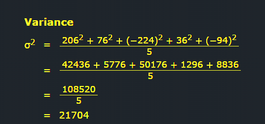

## SD

- In [statistics](https://en.wikipedia.org/wiki/Statistics "Statistics"), the **standard deviation** is a measure of the amount of [variation](https://en.wikipedia.org/wiki/Variance "Variance") of the values of a variable about its [mean](https://en.wikipedia.org/wiki/Expected_value "Expected value").[[1]](https://en.wikipedia.org/wiki/Standard_deviation#cite_note-StatNotes-1) A low standard [deviation](https://en.wikipedia.org/wiki/Deviation_(statistics) "Deviation (statistics)") indicates that the values tend to be close to the [mean](https://en.wikipedia.org/wiki/Mean "Mean") (also called the [expected value](https://en.wikipedia.org/wiki/Expected_value "Expected value")) of the set, while a high standard deviation indicates that the values are spread out over a wider range. The standard deviation is commonly used in the determination of what constitutes an [outlier](https://en.wikipedia.org/wiki/Outlier "Outlier") and what does not.

## Standard Deviation

- The Standard Deviation is a measure of how spread out numbers are.

- Its symbol is **σ** (the greek letter sigma)

- The formula is easy: it is the **square root** of the **Variance.** So now you ask, "What is the Variance?"

## Variance

The Variance is defined as:

The average of the **squared** differences from the Mean.

To calculate the variance follow these steps:

- Work out the [Mean](https://www.mathsisfun.com/mean.html) (the simple average of the numbers)
- Then for each number: subtract the Mean and square the result (the _squared difference_).
- Then work out the average of those squared differences. ([Why Square?](https://www.mathsisfun.com/data/standard-deviation.html#WhySquare))

## Get back repo? --> : [https://github.com/3XCeptional/Ml-and-Data-Science-Notes-Notebooks/](https://github.com/3XCeptional/Ml-and-Data-Science-Notes-Notebooks/)
