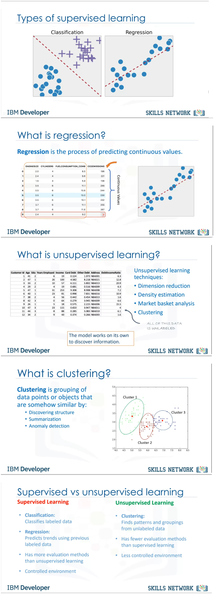

# Supervised vs Unsupervised Learning

## Supervised Learning
- In supervised learning, the training data you feed to the algorithm includes the desired solutions, called labels.
    - **Classification**: A typical supervised learning task is classification. Example: Spam filter that classifies emails as "spam" or "ham" (not spam).
    - **Regression**: Another typical task is predicting continuous outcomes, such as the price of a car, given a set of features (mileage, age, brand, etc.), called predictors.

### Most Important Supervised Learning Algorithms:
- k-Nearest Neighbors (k-NN)
- Linear Regression
- Logistic Regression
- Support Vector Machines (SVMs)
- Decision Trees and Random Forests
- Neural Networks


## Unsupervised Learning
- Unsupervised machine learning is a type of machine learning where the algorithm learns patterns from data that is not labeled. This means the data doesn’t have predefined categories or outcomes. Instead, the algorithm tries to find hidden patterns or groupings within the data on its own.
    - Example: If you have a set of animal photos without labels, an unsupervised algorithm can group similar photos together (e.g., cats in one group and dogs in another).



## Error Metrics: RAE and RSS

### Relative Absolute Error (RAE)
The formula for RAE is:

``` RAE = Σ|actual - predicted| / Σ|actual - mean| ```


- **RAE**: Measures the average absolute difference between actual and predicted values relative to the average absolute difference between actual values and their mean.

### Residual Sum of Squares (RSS)
The formula for RSS is:

`RSS = Σ(actual - predicted)^2`


- **RSS**: Calculates the sum of the squared differences between actual and predicted values.

---

## What is Machine Learning?
Machine learning (ML) is a subdomain of artificial intelligence (AI) that focuses on developing systems that learn—or improve performance—based on the data they ingest. While all machine learning is AI, not all AI is machine learning. AI refers to systems that mimic human intelligence, while ML specifically refers to systems that learn from data without being explicitly programmed.

- **Machine Learning**: It is the field of study that gives computers the capability to learn without being explicitly programmed. Today, ML is used in many applications, more than we might expect.

More on this can be found [here](https://www.geeksforgeeks.org/machine-learning/).

### Two Most Common Use Cases of Supervised Learning
1. **Classification**:
   - Inputs are divided into two or more classes, and the model assigns unseen inputs to one of the classes. For example, spam filtering (binary classification: "spam" or "not spam").
   - **Types**: 
       - Binary Classification
       - Multiclass Classification
       
2. **Regression**:
   - Predicts a continuous numeric value. For example, predicting stock prices using historical data.

More on this topic [here](https://www.geeksforgeeks.org/getting-started-machine-learning/).

## Python’s Role in Machine Learning
Python plays a critical role in machine learning due to its extensive libraries like:
- **NumPy**
- **Pandas**
- **Scikit-learn**
- **TensorFlow**
- **Keras**

These libraries offer tools for data manipulation, analysis, and building machine learning models. Python’s readability and platform independence make it an ideal language for machine learning.

More details can be found --> credits : [**geeksforgeeks**](https://www.geeksforgeeks.org/machine-learning-with-python/?ref=ml_lbp).
