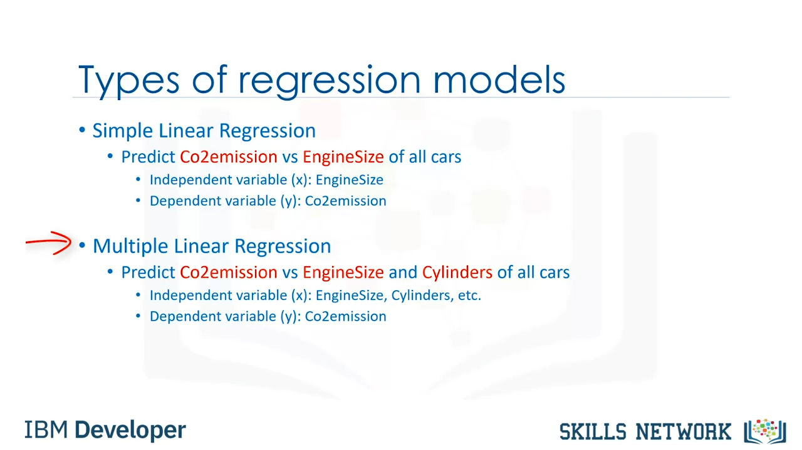

# Linear Regression in Machine Learning

## Overview

Linear regression is a supervised machine learning algorithm that learns from labeled datasets. It maps the data points to the most optimized linear functions, which can be used to predict outcomes on new datasets.

## Supervised Machine Learning

Supervised learning is a type of machine learning where the algorithm learns from labeled data. The labeled data contains input-output pairs where the target value is known. There are two main types of supervised learning:

- **Classification**: Predicts the class or category of the dataset, like determining if an image is of a cat or a dog.
- **Regression**: Predicts continuous output variables based on input features, like estimating house prices based on size, location, etc.

## Types of Linear Regression

- **Simple Linear Regression**: A model with one independent feature predicting one target variable.
- **Multiple Linear Regression**: A model with more than one independent feature predicting a single target variable.
- **Univariate Linear Regression**: A model with one dependent variable.
- **Multivariate Linear Regression**: A model with multiple dependent variables.

## Ordinary Least Squares (OLS) Method

Linear regression models often use the Ordinary Least Squares (OLS) method, which minimizes the sum of squared differences between the observed and predicted values.

## Gradient Descent Algorithm

Another approach to optimizing linear regression models is the Gradient Descent Algorithm, which iteratively adjusts the model parameters to minimize the error.

## Further Reading

- [ML: Linear Regression on GeeksforGeeks](https://www.geeksforgeeks.org/ml-linear-regression/)
- [Ordinary Least Squares Method: Concepts & Examples](https://vitalflux.com/ordinary-least-squares-method-concepts-examples/)
- [Gradient Descent Algorithm and its Variants](https://www.geeksforgeeks.org/gradient-descent-algorithm-and-its-variants/)

## Video Resources

- [Linear Regression in Machine Learning - Video](https://d3c33hcgiwev3.cloudfront.net/sKI09HJkQHSiNPRyZMB09A.processed/full/720p/index.webm)
